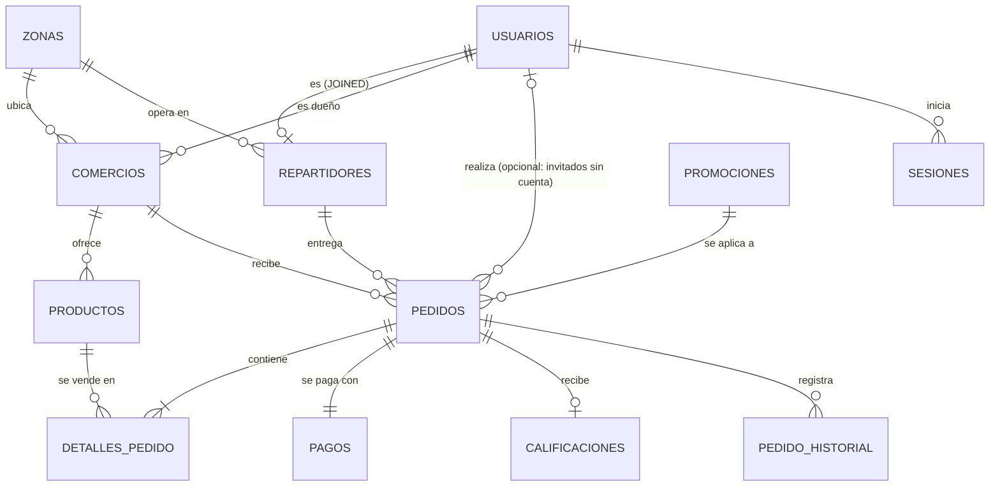

# Diagramas (Mermaid)

Pégalos en https://mermaid.live para exportarlos como imagen para el entregable.

## Diagrama de clases UML

```mermaid
classDiagram
    direction TB
    class Rastreable { <<interface>> +obtenerSeguimiento() String }
    class Calificable { <<interface>> +registrarCalificacion(int) +getCalificacionPromedio() double }
    class Notificable { <<interface>> +getDestinoNotificacion() String +notificar(String) }

    class Usuario { -Long id -String nombre -String email -String passwordHash -Rol rol -boolean activo }
    class Repartidor { <<abstract>> -boolean disponible -double latitud -double longitud +getTipoVehiculo()* +getVelocidadPromedioKmH()* +getCapacidadMaxima()* +calcularTiempoEstimadoMin(km) }
    class RepartidorMoto
    class RepartidorBicicleta
    class RepartidorAutomovil
    Usuario <|-- Repartidor
    Repartidor <|-- RepartidorMoto
    Repartidor <|-- RepartidorBicicleta
    Repartidor <|-- RepartidorAutomovil
    Notificable <|.. Usuario
    Rastreable <|.. Repartidor
    Calificable <|.. Repartidor

    class Comercio { -String nombre -double latitud -double longitud -boolean abierto -int tiempoPreparacionMin }
    Calificable <|.. Comercio
    Notificable <|.. Comercio
    class Producto { -String nombre -BigDecimal precio -boolean disponible }
    Comercio "1" --> "*" Producto

    class Pedido { -EstadoPedido estado -BigDecimal total -String codigoSeguimiento -String nombreContacto -String telefonoContacto +cambiarEstado(EstadoPedido) +asignarRepartidor(Repartidor) }
    class DetallePedido { -int cantidad -BigDecimal precioUnitario }
    Rastreable <|.. Pedido
    Pedido "1" *-- "*" DetallePedido
    Pedido "*" --> "0..1" Usuario : cliente (null = invitado)
    Pedido "*" --> "1" Comercio
    Pedido "*" --> "0..1" Repartidor

    class Pago { <<abstract>> -EstadoPago estado -String idTransaccion +validar()* +procesar() +cobrarAlEntregar(efectivo) +cancelar() +seProcesaAlEntregar() +requiereAutenticacion() }
    class PagoEfectivo
    class PagoTarjeta
    class PagoTransferencia
    Pago <|-- PagoEfectivo
    Pago <|-- PagoTarjeta
    Pago <|-- PagoTransferencia
    Pedido "1" --> "1" Pago

    class Promocion { <<abstract>> +calcularDescuento(subtotal, envio)* }
    class PromocionPorcentaje
    class PromocionMontoFijo
    class PromocionEnvioGratis
    Promocion <|-- PromocionPorcentaje
    Promocion <|-- PromocionMontoFijo
    Promocion <|-- PromocionEnvioGratis
    Pedido "*" --> "0..1" Promocion

    class CriterioAsignacion { <<interface>> +esElegible() +puntuar() +peso() }
    class AsignacionService
    AsignacionService --> "6" CriterioAsignacion
```

## Modelo entidad-relación

```mermaid
erDiagram
    ZONAS ||--o{ COMERCIOS : "ubica"
    ZONAS ||--o{ REPARTIDORES : "opera en"
    USUARIOS ||--o| REPARTIDORES : "es (JOINED)"
    USUARIOS ||--o{ COMERCIOS : "es dueño"
    USUARIOS |o--o{ PEDIDOS : "realiza (opcional: invitados sin cuenta)"
    USUARIOS ||--o{ SESIONES : "inicia"
    COMERCIOS ||--o{ PRODUCTOS : "ofrece"
    COMERCIOS ||--o{ PEDIDOS : "recibe"
    REPARTIDORES ||--o{ PEDIDOS : "entrega"
    PEDIDOS ||--|{ DETALLES_PEDIDO : "contiene"
    PRODUCTOS ||--o{ DETALLES_PEDIDO : "se vende en"
    PEDIDOS ||--|| PAGOS : "se paga con"
    PROMOCIONES ||--o{ PEDIDOS : "se aplica a"
    PEDIDOS ||--o| CALIFICACIONES : "recibe"
    PEDIDOS ||--o{ PEDIDO_HISTORIAL : "registra"
```
